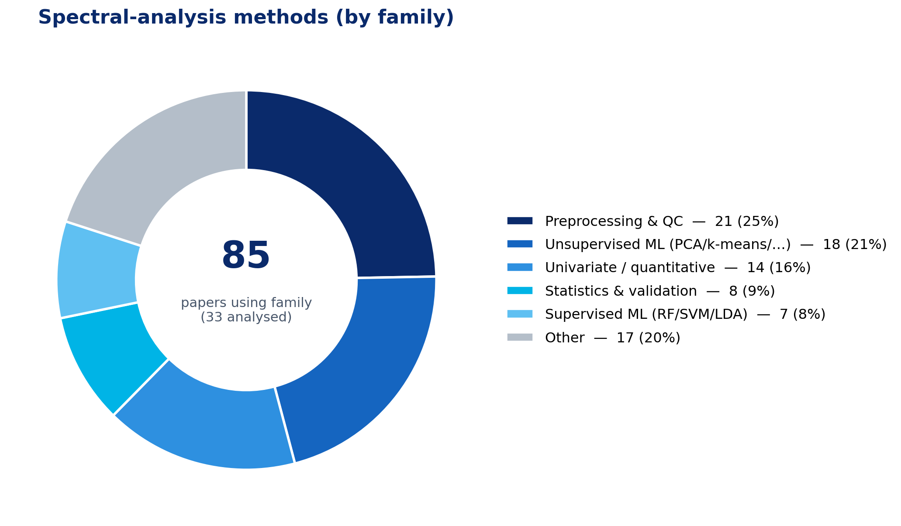
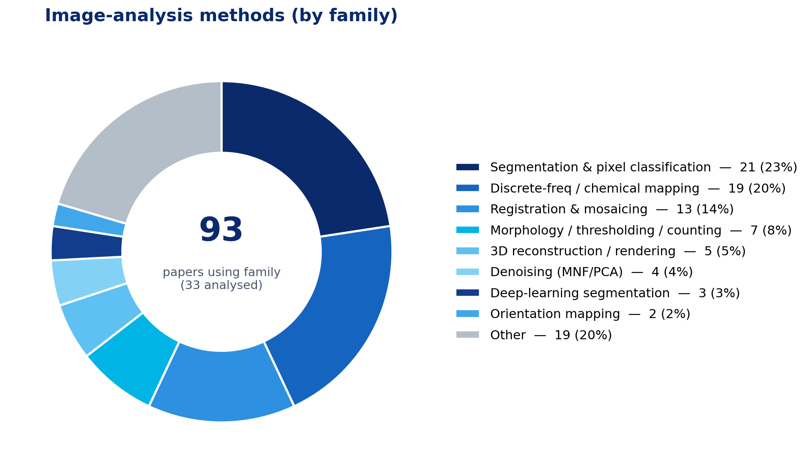
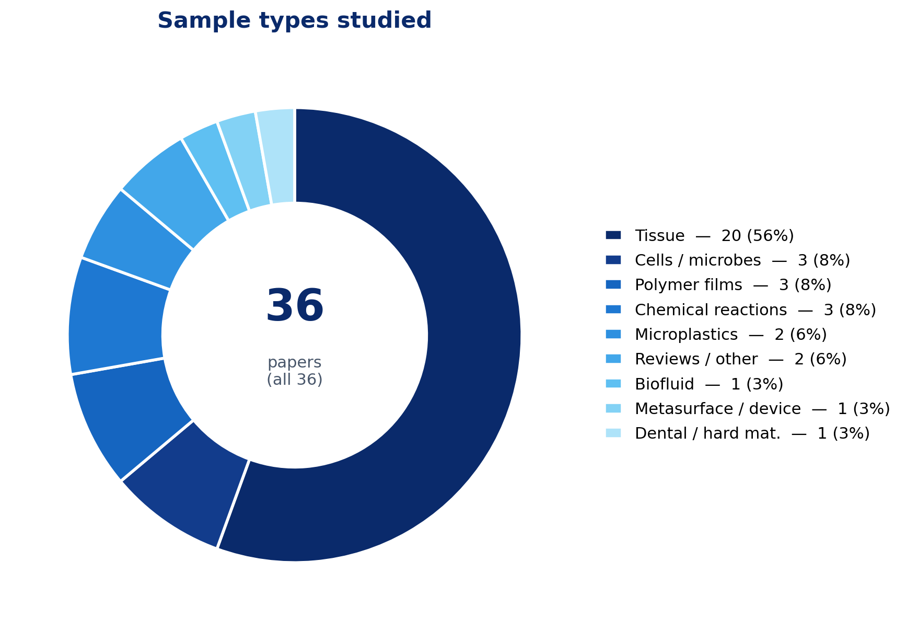
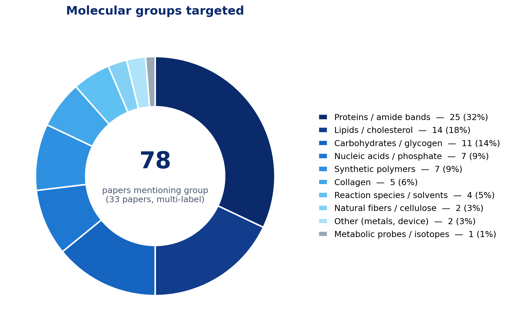

# Spero (QCL-IR) Publications — Analytical Overview

**ProMetronics GmbH** · Project **LEONARDO-Ftir** (Leonardo DRS Spero FTIR microscope · AI enablement)
**Author:** Dr. André Kempe (andre.kempe@prometronics.com) · **Date:** 2026-07-15 · **Version:** v20

Structured synthesis of the **36** Spero-filtered papers from the Daylight Solutions / Leonardo DRS research archive (see `../00_Project_Input/publications/`). **33** papers had a machine-readable full text and were analysed in depth; **3** are excluded from the statistics (#12 and #25 are image-only press/application notes without a text layer, #27 is a broken 4 KB CDN stub). Extraction was done per paper across four dimensions (sample & molecules, data & parameters, spectral processing, image processing) and verified against the source texts.

> Scope note: the archive filter is *product = Spero*, but a few entries use related Daylight/QCL instruments rather than the Spero microscope (#18 MIRcat-based optoacoustic **MiROM**; #24 **Hedgehog**-laser photothermal add-on) or are reviews (#2, #20) / a non-Spero metasurface sensor (#15). These are flagged in the appendix.

*Machine-generated from the extracted corpus; figures reflect what each paper explicitly reports ("N/R" = not reported). Companion data table: `Spero_Publications_Data.xlsx`.*

---

## Corpus at a glance

- **Papers analysed:** 33 of 36 (3 excluded: #12, #25, #27).
- **Publication years:** 2014–2026; peak 2017 (9 papers). Corpus is recent-weighted, with deep-learning studies appearing 2022–2026.
- **Acquisition modality:** transmission dominates (26 papers primary), reflection primary in 4 (several instruments also offer reflection), plus 1 optoacoustic and 1 photothermal variant.
- **Spectral range:** almost all work in the mid-IR fingerprint window ~**900–1800 cm⁻¹** at **2–8 cm⁻¹** resolution; the standard detector is a **480×480 uncooled microbolometer**.
- **Data volume is under-reported:** only **7/33** papers state an explicit storage size; most report pixel/spectra counts only (see §2).

### Sample-type distribution (all 36)

| Sample type | Papers | IDs |
|---|---|---|
| Tissue (histopathology) | 20 | 1, 3, 5, 7, 9, 10, 11, 12, 13, 16, 18, 19, 20, 21, 22, 26, 29, 30, 31, 32 |
| Biofluid (serum) | 1 | 17 |
| Cells / microbes | 3 | 4, 23, 24 |
| Microplastics / fibers | 2 | 33, 35 |
| Polymer films | 3 | 14, 28, 36 |
| Chemical reactions / microfluidics | 3 | 6, 8, 34 |
| Metasurface / device | 1 | 15 |
| Dental / hard material | 1 | 27 |
| Reviews / other | 2 | 2, 25 |

---

## Visual summary

**Methods — spectral vs. image analysis.** Method families across the 33 analysed papers (a paper may use several families).

**What is measured — sample types and molecular groups.**

*Charts are regenerated from `Spero_Publications_Data.xlsx` / the extracted corpus; molecular-group and method-family assignments are multi-label (papers can appear in several slices).*

---

## 1) Sample types, molecular targets & object sizes

Molecules/bands and object scales aggregated per sample type (union across papers in that group).

| Sample type | Typical molecular / IR-band targets | Object-size range (thickness · pixel · FOV · feature) |
|---|---|---|
| **Tissue (histopathology)** | proteins (amide I); lipids/lipid esters; protein-to-lipid ratio; glucose (1031 cm-1); glycogen (1024/1152/1162 cm-1); lactate (1127 cm-1); proteins (amide I 1656 cm-1 tissue mask); biochemical fingerprint; collagen (amide III 1232; CH2 1336 cm-1); glycogen (1028/1080/1152 cm-1); reactive fibrosis; proteins (amide I/II 1700-1480 cm-1); lipids (1480-1430 cm-1); protein/lipid ratio | 3–20 µm sections; pixel 1.35–4.25 µm (0.66 µm HD); FOV 0.65×0.65–2×2 mm; TMA cores ~1 mm; features ≥5 µm |
| **Biofluid (serum)** | amide I (1651/1654); amide II (1548/1546); C=O stretch; C-N stretch; N-H bend; serum proteome | dried serum spots ~100–1000 µm; pixel 1.36 / 4.25 µm; FOV 0.65 / 2×2 mm |
| **Cells / microbes** | proteins (amide I ~1600-1630, amide II ~1530 cm-1); anti-parallel/parallel β-sheet / cross-β amyloid; lipids (1450/1400 cm-1); phosphodiesters (1200/1240 cm-1); polysaccharides (1080/1111 cm-1); α/β-glucan; azide (2098-2100); 13C amide I (1616); 13C ester carbonyl (1741/1697); C-D (2140-2184); amide I (1651); lipid ester (1740); CH2 (2924); AHA | single cells (tens of µm) & 10–20 µm sections; pixel 0.66–5.5 µm; ~5 µm microbeads |
| **Microplastics / fibers** | PE/LDPE; PP; PVC; PS; polyamide (PA); polyester/PET; PTFE; silicone; acrylate/PCL/varnish; cellulose/cellulose acetate; beeswax; amide I/II; lyocell; cotton | particles/fibers 1–>75 µm; pixel 1.36 / 4.19 µm; scan areas up to ~144 mm² |
| **Polymer films** | νas(COC) 1244; ν(CC) 1296; ν(C=O) 1730; b(CH2) 1420; δ(CH2) 1470 cm-1; PP (ν(C-C) 1168, δ(C-H) ~1460, 998/973); EVOH (ν(C-O) ~1080 cm-1); ν(C=O) 1730 (cryst 1726/amorph 1736); ν(COC) 1244 (cryst 1242/amorph 1236) | films 1–300 µm thick; spherulites 50–100 µm; barrier layers 30–160 µm; pixel 1.4 µm; FOV 650 µm |
| **Chemical reactions / microfluidics** | benzaldehyde (1704 cm-1); benzylidene aniline (1194 cm-1); aniline; acetonitrile; imine C=N product; LDA (1112 cm-1); phenyl isocyanate (1108 cm-1); lithium salt product (1580 cm-1); H2O (1640); D2O (1200); HOD (1442 cm-1) | channels/droplets ~100–250 µm; 20–150 µm cell depth; pixel 1.4–4.3 µm; FOV 0.65–2×2 mm |
| **Metasurface / device** | biomolecules (protein); polymer; pesticide | N/R (device pixels tuned per resonance) |
| **Dental / hard material** | — | N/R (source PDF broken) |
| **Reviews / other** | proteins (amide I/II/III); lipids/fatty acyl chains; collagen; DNA/nucleic acids (PO2-); glucose; glycogen; cholesterol; phenylalanine; metals (Fe/Cu/Zn) | reviews: IR ~1–10 µm resolution across techniques |

**Reading:** tissue work is overwhelmingly about the **protein (amide I ~1650 / amide II ~1540 cm⁻¹)**, **lipid (~1740 / 1450 cm⁻¹)**, **nucleic-acid/phosphate (PO₂⁻ ~1080/1236 cm⁻¹)**, **glycogen/carbohydrate (~1030–1150 cm⁻¹)** and **collagen** bands; polymers and microplastics are identified by polymer-specific fingerprints (C–O, C–C, C=O, C–O–C); reaction studies track individual reactant/product bands for quantification.

---

## 2) Data volume & typical acquisition parameters

**Data-volume reporting is sparse.** Of 33 analysed papers, 31 give some size metric (pixel/spectra counts, tile counts) but only **7** state an explicit **storage size**: IDs 1, 2, 5, 11, 13, 17, 22. Where reported, single hypercubes are typically **480×480×(200–430)** ≈ 0.2 M spectra (~2–100 MB depending on spectral depth), and stitched mosaics reach **10–90 million spectra** (hundreds of MB to a few GB); one 3D brain study reached **~89 M spectra / 250 GB raw**, and reviews estimate **up to ~10 TB** for 1 cm³ at 5 µm.

### Representative reported data volumes

| ID | Sample | Reported volume |
|---|---|---|
| 1 | tissue | ~89.1x10^6 spectra; 250 GB raw → 10 GB after 5x5 binning; 170-190 IR images/brain; 370 sections |
| 2 | other | 3D matrices up to ~10 TB for 1 cm3 at 5 µm; millions-billions of spectra |
| 5 | tissue | Cubes 480x480x226 (102 MB) or x4 (2 MB); 3x3 mosaic 2.07M spectra (918 MB full / 18 MB sparse); 9x6 mosaic 12.4M spectra (108 MB) |
| 11 | tissue | Full cube 480x480x256=102 MB; sparse x10=5 MB; 3x3 mosaic 2.07M px (918 MB full vs 45 MB sparse); 226 images/cube |
| 13 | tissue | 50 cores / 29 patients; single core 27 wavelengths=921,600 px; stitched 960x960x27 (~80 MB/core) vs 13 GB FTIR; 207,505 spectra/class |
| 17 | biofluid | 40/56 replicate spots; 50 patient spots (10+40); mosaic 2400x4800=1.34e7 spectra; 14-freq mosaic 1.88e8 pts=1.83 GB RAM; 199-freq 2.68e9 pts |
| 22 | tissue | FTIR amide-I ~19M px; QCL ~26.5M px (10x12 tiles); full FTIR interferogram TMA >100 GB; 207 cores |
| 29 | tissue | TMA 11x13 mosaic, 143 tiles, 33M px in 13.6 h; tile 230,400 spectra x 223 pts; core cube 313x313x223=97,969; ~8M classified px; storage N/R |
| 33 | microplastics | LowMag 36 fields in 36 min; HighMag 400 fields=92.1M spectra→361 fields; ~8M spectra analyzed in 6 h; MATLAB + per-particle CSV/Excel; storage N/R |

### Typical acquisition parameters per sample type

| Sample type | Spectral range · resolution | Objective / pixel / FOV | Mode | Frequencies |
|---|---|---|---|---|
| **Tissue (histopathology)** | 900–1800 cm⁻¹ · 2–8 cm⁻¹ | 4×/0.15–0.3 NA (4.25 µm, 2×2 mm) or 12.5×/0.7 NA (1.35 µm, 0.65 mm) | transmission | full-band or discrete (10–27 λ) |
| **Biofluid (serum)** | 1000–1800 cm⁻¹ · 4 cm⁻¹ | 12.5× (1.36 µm) & 4× (4.25 µm) | transmission | discrete (9/14/199 λ) |
| **Cells / microbes** | 1200–1800 (+2000–2300) cm⁻¹ · 4 cm⁻¹ | 4–25× (0.66–5.5 µm) | transmission | discrete / single-frequency |
| **Microplastics / fibers** | 950–1800 cm⁻¹ · 2 cm⁻¹ | 4× (4.19 µm) & 12.5× (1.36 µm) | transmission / reflection | full-band + DF overview (1470 cm⁻¹) |
| **Polymer films** | 1000–1800 cm⁻¹ · 2 cm⁻¹ | 12.5×/0.7 NA (1.4 µm, 0.65 mm) | transmission / reflection | continuous + 24-step polarization (OPPIR) |
| **Chemical reactions / microfluidics** | 900–1900 cm⁻¹ · 2–4 cm⁻¹ | 4–12.5× (1.4–4.3 µm) | transmission | discrete-frequency video (≤30 fps) |

**Reading:** the recurring instrument envelope is a four-QCL Spero/Spero-QT covering the fingerprint region on a 480×480 microbolometer, with a **speed/throughput vs. resolution** trade governed by choosing **discrete-frequency** imaging (a handful of diagnostic wavenumbers) over full hyperspectral cubes — several papers quantify **16–50× smaller data and ~10–260× faster acquisition than FTIR**.

---

## 3) Spectral processing — maths, physical models & software

### Most-used spectral methods (count of analysed papers)

| Mathematical / chemometric method | Papers |
|---|---|
| baseline correction | 13 |
| normalization (vector/SNV/min-max) | 11 |
| univariate peak/band analysis | 8 |
| PCA | 8 |
| k-means clustering | 7 |
| random forest | 7 |
| spectral quality control | 7 |
| 2nd derivative | 6 |
| peak fitting / deconvolution | 4 |
| statistical testing | 4 |
| classifier validation (ROC/CV) | 4 |
| hierarchical clustering | 4 |
| linear regression / calibration | 2 |
| LDA | 2 |
| PCA-LDA | 2 |
| SVM | 2 |

| Physical model applied to spectra | Papers |
|---|---|
| Beer-Lambert quantification | 9 |
| Mie / RMieS scattering correction | 7 |
| diffraction / coherence / interference optics | 3 |
| polarization / 3D-orientation model | 2 |
| protein secondary-structure model | 1 |
| reaction-kinetics model | 1 |
| metasurface resonance | 1 |
| optoacoustic signal model | 1 |
| isotope band-shift model | 1 |
| off-resonance subtraction | 1 |

| Spectral-processing software | Papers |
|---|---|
| MATLAB | 13 |
| Epina ImageLab | 4 |
| ChemVision (Daylight) | 3 |
| Python | 3 |
| randomforest-matlab | 2 |
| ENVI-IDL | 2 |
| OriginPro | 2 |
| DynoChem 2011 | 1 |
| ProSpect Toolbox | 1 |
| ImageJ | 1 |
| Chemical Vision (Daylight) | 1 |
| Cytospec | 1 |

### By sample type

| Sample type | Key spectral maths | Physical models | Software |
|---|---|---|---|
| **Tissue (histopathology)** | baseline correction, normalization (vector/SNV/min-max), random forest, PCA, 2nd derivative, k-means clustering | Mie / RMieS scattering correction, Beer-Lambert quantification, diffraction / coherence / interference optics, optoacoustic signal model | MATLAB, Epina ImageLab, randomforest-matlab, ENVI-IDL, ProSpect Toolbox |
| **Biofluid (serum)** | k-means clustering, SVM, normalization (vector/SNV/min-max), univariate peak/band analysis, 3-fold CV, classifier validation (ROC/CV) | — | MATLAB |
| **Cells / microbes** | spectral quality control, k-means clustering, chemical / false-color mapping, z-score, band assignment, PCA | Beer-Lambert quantification, protein secondary-structure model, isotope band-shift model, off-resonance subtraction | Cytospec, Epina ImageLab, CellProfiler, MATLAB, GraphPad Prism |
| **Microplastics / fibers** | spectral library matching, hierarchical clustering, normalization (vector/SNV/min-max), statistical testing, reference overlap | — | Python, PRIMER 6, OriginPro, Bruker OPUS 7.5, MATLAB |
| **Polymer films** | baseline correction, absorptance/absorbance conversion, error-propagation, univariate peak/band analysis, PCA, MCR-ALS | polarization / 3D-orientation model, diffraction / coherence / interference optics, scattering / interference optics, Beer-Lambert quantification | Python, MATLAB, MCR-ALS toolbox |
| **Chemical reactions / microfluidics** | linear regression / calibration, univariate peak/band analysis, reference/background subtraction, band-intensity tracking, band-difference correction, normalization (vector/SNV/min-max) | Beer-Lambert quantification, reaction-kinetics model | ChemVision (Daylight), MATLAB, DynoChem 2011, Epina ImageLab |
| **Reviews / other** | peak fitting / deconvolution, 2nd derivative, peak-picking, baseline correction, clustering, machine learning | — | — |

**Reading:** spectral pipelines split into (a) **preprocessing** — baseline correction, normalization, derivatives (Savitzky-Golay), and Mie/RMieS-EMSC scattering correction — and (b) **discrimination** — from unsupervised **PCA / k-means** to supervised **random forest, PLS/PCA-LDA, SVM**, and increasingly **deep learning**. The dominant *physical* models are **Beer-Lambert** (for quantitative reaction/tissue work) and **resonant-Mie scattering correction** (for FFPE tissue). **MATLAB** is the workhorse, with **Epina ImageLab**, **ENVI-IDL**, **ChemVision** (instrument software) and **Python** recurring.

---

## 4) Image processing — maths, physical models & software

### Most-used image methods (count of analysed papers)

| Image-domain method | Papers |
|---|---|
| discrete-frequency imaging | 10 |
| segmentation | 9 |
| chemical / false-color mapping | 9 |
| image registration | 6 |
| mosaic tiling/stitching | 6 |
| 3D reconstruction/rendering | 5 |
| thresholding | 5 |
| k-means clustering | 5 |
| noise-fraction denoising | 4 |
| interpolation | 3 |
| CNN / deep learning | 3 |
| univariate peak/band analysis | 3 |
| supervised classification | 2 |
| supervised classification (RF) | 2 |
| temporal (per-pixel) analysis | 2 |
| orientation / order-parameter mapping | 2 |

| Physical model in imaging | Papers |
|---|---|
| diffraction / coherence / interference optics | 11 |
| tomographic reconstruction | 2 |
| polarization / 3D-orientation model | 2 |
| Mie / RMieS scattering correction | 2 |
| metasurface resonance | 1 |
| scattering / interference optics | 1 |
| optoacoustic signal model | 1 |
| photothermal / refractive-index model | 1 |
| halo-effect model | 1 |
| native polymer epifluorescence under UV/blue-violet excitation | 1 |

| Image-processing software | Papers |
|---|---|
| MATLAB | 10 |
| Epina ImageLab | 4 |
| ChemVision (Daylight) | 2 |
| Python | 2 |
| ENVI-IDL | 1 |
| MevisLab | 1 |
| CompSegNet (U-Net) | 1 |
| custom registration software | 1 |
| ImageJ | 1 |
| Chemical Vision (Daylight) | 1 |
| CellProfiler | 1 |
| Histolab | 1 |

### By sample type

| Sample type | Key image maths | Physical models | Software |
|---|---|---|---|
| **Tissue (histopathology)** | discrete-frequency imaging, chemical / false-color mapping, segmentation, image registration, thresholding, mosaic tiling/stitching | diffraction / coherence / interference optics, Mie / RMieS scattering correction, tomographic reconstruction, optoacoustic signal model | MATLAB, Epina ImageLab, ENVI-IDL, MevisLab, CompSegNet (U-Net) |
| **Biofluid (serum)** | discrete-frequency imaging, k-means clustering, mosaic tiling/stitching | scattering / interference optics | MATLAB |
| **Cells / microbes** | chemical / false-color mapping, k-means clustering, 3D reconstruction/rendering, discrete-frequency imaging, segmentation, noise-fraction denoising | diffraction / coherence / interference optics, photothermal / refractive-index model, halo-effect model | Epina ImageLab, CellProfiler |
| **Microplastics / fibers** | particle counting, segmentation, discrete-frequency polymer mapping, area-based size classification, mass from density, color/fluorescence classification (synthetic vs natural) | diffraction / coherence / interference optics, native polymer epifluorescence under UV/blue-violet excitation | APA/APAv1.1.1, siMPle, Python, OriginPro, Inkscape 0.92 |
| **Polymer films** | orientation / order-parameter mapping, histogram analysis, chemical / false-color mapping, spatial constraints in MCR, composite two-frequency images, segmentation | diffraction / coherence / interference optics, polarization / 3D-orientation model | Python, MATLAB |
| **Chemical reactions / microfluidics** | discrete-frequency imaging, temporal (per-pixel) analysis, hyperspectral imaging, ROI / pixel selection, droplet-volume estimation, univariate peak/band analysis | — | ChemVision (Daylight), MATLAB, Epina ImageLab |
| **Reviews / other** | 3D reconstruction/rendering, image registration, segmentation, clustering | tomographic reconstruction | — |

**Reading:** the signature image operation is **discrete-frequency imaging** (building chemical maps from a few wavenumbers), followed by **segmentation / supervised pixel classification**, **mosaic stitching**, **noise-fraction (MNF) denoising**, and **registration** to H&E/histology. Physically, imaging is bounded by **diffraction-limited resolution (~5 µm)** and **QCL laser-coherence / interference (fringe)** effects that several papers explicitly model or mitigate; specialised studies add **3D orientation tensors (OPPIR)**, **tomographic reconstruction**, and **optoacoustic/photothermal** contrast. Image software centers on **MATLAB**, with **Epina ImageLab**, **ChemVision**, **ImageJ**, **CellProfiler**, and dedicated deep-learning nets (**CompSegNet/U-Net**) plus microplastics tools (**siMPle**, **APA**).

---

## 5) AI (deep/PINN neural networks) vs. classic ML vs. standard algorithmics

**Classification rule (strict).** Only **deep neural networks (DNN)** and **physics-informed neural networks (PINN)** are counted as *AI*. Every other learned model — random forest, SVM, PLS-DA, LDA/PCA-LDA, PCA, k-means, HCA, NMF, MCR-ALS — is **classic machine learning (ML)**. Deterministic signal/image processing and closed-form physics are **standard algorithmics**.

**Headline:** **AI (deep NN): 3** papers — #3, #9, #19. **Classic ML: 18** (supervised 10, unsupervised 8). **Standard algorithmics: 12**. So of the 33 analysed papers only **3** use methods that qualify as AI under this definition; 18 use classic ML; 12 are purely deterministic.

### PINN investigation — are any neural networks physics-informed?

The full text of all three neural-network papers (and the whole corpus) was searched for *physics-informed / PINN / physical loss / physical constraint / molecular-orbital / ab-initio / DFT* structures. **Result: none.**

- **#3** (*Falsifiable explanations…*, 2022) — **CompSegNet** (a weakly-supervised U-Net) plus a **ResNet-18** baseline. Standard data-driven CNNs trained with ordinary segmentation/cross-entropy losses; no physical equations in the architecture or loss.
- **#9** (*Colon-cancer MSI detection*, 2023) — **CompSegNet (U-Net)** + **VGG-11** classifier. Purely data-driven; no physics term.
- **#19** (*Aβ-plaque detection*, 2025) — **CompSegNet** (depth-reduced U-Net, semi-supervised). Data-driven; ground truth from IHC masks, no physical model embedded.

**Conclusion: 0 PINN in the corpus.** All AI here is conventional deep learning that learns purely from labelled data. No paper embeds vibrational/quantum-chemical physics (e.g. molecular-orbital-derived band positions) into the model — the single largest methodological gap versus a physics-informed approach (see §6.1 and §6.2C).

### Key patterns (re-cast)

- **AI = deep learning, recent and concentrated.** Only 3 papers (2022–2025), all the same **CompSegNet/U-Net** lineage (+ VGG/ResNet), doing tumour or Aβ-plaque **segmentation** directly on 427-channel IR image cubes. This is the field's frontier — but still *data-driven only*, not physics-informed.
- **Classic ML dominates the 'automated' papers.** The clinical-histopathology cluster (#13, #21, #29, #30, #31) runs pixel-wise **random forest** on preprocessed spectra (tissue type, malignancy, MSI status, KRAS/EGFR/TP53 mutations); **LDA/PCA-LDA** (#16, #26) and **RBF-SVM** (#17) cover smaller cohorts. Unsupervised classic ML — **k-means** (#4, #5, #11, #17), **PCA** (#16, #26, #32), **NMF** (#18), **MCR-ALS** (#28) — handles segmentation, exploration and unmixing. None of these are neural networks.
- **Standard algorithmics still carry 12 papers** — quantitative reaction/kinetics (#6, #8, #34), polarization-orientation physics (#14, #36), metabolic unmixing (#23), photothermal contrast (#24), throughput demos (#22), and **microplastics ID by spectral-library matching** (#33 primary, #35).
- **Physics feeds ML but is never AI itself.** Beer-Lambert, Mie/RMieS-EMSC correction, OPPIR orientation are deterministic models applied *before* the ML step; they are not learned. A PINN would fold such physics *into* the network — nobody here does.

### Per-paper classification (analysed papers)

| ID | Sample | Class | Learned method(s) | Acts on | Task |
|---|---|---|---|---|---|
| 3 | tissue | AI (deep NN) | U-Net (CompSegNet, weakly-supervised), ResNet-18 (baseline) | spectra, image | tumor localization + cancer vs cancer-free on 427-channel IR WSI |
| 9 | tissue | AI (deep NN) | U-Net (CompSegNet), VGG-11 | spectra, image | two-step cancer detection then MSI vs MSS on label-free IR |
| 19 | tissue | AI (deep NN) | CompSegNet (depth-reduced U-Net, semi-supervised CNN) | image, spectra | amyloid-β plaque detection/segmentation on IR WSI |
| 7 | tissue | classic ML (supervised) | random forest, PCA (denoising), MNF (denoising) | spectra, image | pancreatic tissue classification; denoising effect study |
| 13 | tissue | classic ML (supervised) | random forest (+GINI feature ranking) | spectra, image | prostate cancer vs normal-epithelium + wavelength selection |
| 16 | tissue | classic ML (supervised) | PCA-LDA, PCA | spectra | hepatocyte vs fibrosis / diabetic grading |
| 17 | biofluid | classic ML (supervised) | RBF-SVM, k-means (QC) | spectra, image | serum cancer vs non-cancer classification |
| 20 | tissue | classic ML (supervised) | PCA, HCA, k-means, LDA, SVM, random forest | spectra, image | review of supervised+unsupervised chemometrics for tissue discrimination |
| 21 | tissue | classic ML (supervised) | random forest (3 hierarchical) | spectra, image | healthy/pathologic + cancer type + MSI-H vs MSS |
| 26 | tissue | classic ML (supervised) | PCA-LDA, PCA | spectra | fibrosis progressor vs non-progressor discrimination |
| 29 | tissue | classic ML (supervised) | random forest, PCA (denoising) | spectra, image | tissue-type + malignant-stroma classification (breast TMA) |
| 30 | tissue | classic ML (supervised) | random forest (5-level hierarchical), k-means, HCA | spectra, image | lung tissue+tumor type + KRAS/EGFR/TP53 mutation status |
| 31 | tissue | classic ML (supervised) | random forest (2-level), HCA, k-means | spectra, image | colorectal healthy/pathologic + cancer classification |
| 2 | other | classic ML (unsupervised) | clustering (spectromics), data mining (discussed) | spectra | cluster-based spectromics segmentation (review) |
| 4 | cells | classic ML (unsupervised) | k-means | spectra, image | biofilm chemospatial segmentation |
| 5 | tissue | classic ML (unsupervised) | k-means | spectra, image | fibrosis/hepatocyte/glycogen tissue segmentation |
| 11 | tissue | classic ML (unsupervised) | k-means (6 clusters) | spectra, image | colorectal tissue-structure segmentation |
| 18 | tissue | classic ML (unsupervised) | NMF | spectra, image | carotid-plaque tissue-component decomposition (3 components) |
| 28 | polymer | classic ML (unsupervised) | PCA, MCR-ALS | image, spectra | PP/EVOH layer unmixing in polymer film |
| 32 | tissue | classic ML (unsupervised) | PCA | spectra | serum cancer separation / discriminating-frequency selection |
| 33 | microplastics | classic ML (unsupervised) | HCA (reference-DB clustering) | spectra | HCA organizes polymer reference DB; particle ID by library matching (classical) |
| 1 | tissue | standard algorithmics | — (deterministic) | — | — |
| 6 | chemical-reaction/microfluidic | standard algorithmics | — (deterministic) | — | — |
| 8 | chemical-reaction/microfluidic | standard algorithmics | — (deterministic) | — | — |
| 10 | tissue | standard algorithmics | — (deterministic) | — | — |
| 14 | polymer | standard algorithmics | — (deterministic) | — | — |
| 15 | metasurface/device | standard algorithmics | — (deterministic) | — | — |
| 22 | tissue | standard algorithmics | — (deterministic) | — | — |
| 23 | cells | standard algorithmics | — (deterministic) | — | — |
| 24 | cells | standard algorithmics | — (deterministic) | — | — |
| 34 | chemical-reaction/microfluidic | standard algorithmics | — (deterministic) | — | — |
| 35 | microplastics | standard algorithmics | — (deterministic) | — | — |
| 36 | polymer | standard algorithmics | — (deterministic) | — | — |

---

## 6) Method reference — physical models, mathematical methods & image-domain methods

Every model/method in the corpus, grouped by whether it is **AI (deep/PINN neural network)**, **classic ML** (learns from data but not a neural network), or **standard algorithmics** (deterministic). Grouping is intrinsic to the algorithm, not the sample type.

### 6.1 Physical models (all standard / closed-form — none are AI)

- **Molecular-orbital / quantum-chemical vibrational modeling** *(not used in this corpus, but foundational — included per request)* — IR band positions and intensities originate from vibrational normal modes whose force constants are fixed by the molecule's **electronic structure**, i.e. its occupied and virtual **molecular orbitals** and their bonding/antibonding character. **Ab-initio / DFT (density-functional-theory)** calculations solve for these orbitals, build the Hessian (force-constant matrix) from the electronic energy, and predict the vibrational spectrum — harmonic (and optionally anharmonic) frequencies plus IR intensities from the dipole-moment derivatives along each mode. Such first-principles spectra give *physically-grounded* band assignments and class-defining features. Crucially, they are the natural physical model to embed in a **physics-informed neural network (PINN)** for spectral classification: the network can be constrained so that the bands it relies on remain consistent with quantum-chemical vibrational physics, reducing the labelled-data demand and improving transfer across instruments/samples. **No paper in this corpus computes MO/DFT spectra** — all band assignments are empirical/literature-based, which is exactly the gap a PINN approach would close.
- **Beer–Lambert quantification** — absorbance ∝ concentration × path length × absorptivity; converts band intensities to concentrations (reaction monitoring #6/#8/#34, quantitative tissue #1). Deterministic.
- **Resonant Mie / RMieS-EMSC scattering correction** — cells/FFPE tissue scatter IR (Mie resonances) distorting baselines and band shapes; an Extended Multiplicative Signal Correction with a resonant-Mie model iteratively removes it (preprocessing before ML in #20/#21/#30/#31). Several groups instead suppress it physically via refractive-index-matching wax (#13/#22/#29).
- **Diffraction / coherence / interference optics** — the ~5 µm diffraction limit sets resolution; the QCL's coherent light adds speckle and interference fringes absent in incoherent FTIR (characterised in #10/#29/#31, mitigated in #23).
- **Polarization / 3D-orientation model (OPPIR)** — IR dichroism: a band's absorbance depends on the angle between its transition dipole and the light polarization; orthogonal-pair polarization IR reconstructs 3-D chain orientation and order parameter ⟨P₂⟩ (#14/#36).
- **Optoacoustic (photoacoustic) signal model** — absorbed mid-IR pulses cause thermoelastic expansion detected as ultrasound → positive-contrast absorption images (#18).
- **Photothermal / refractive-index model** — mid-IR absorption heats the sample, changing refractive index, read by a visible phase-contrast camera; a heat-diffusion decay model links signal to absorption (#24).
- **Protein secondary-structure model** — amide I band shape encodes α-helix vs β-sheet; used to read cross-β amyloid (#4/#19).
- **Reaction-kinetics (Arrhenius) model** — rate constants fitted to time-resolved concentration maps (#8).
- **Isotope band-shift model** — ¹³C/²H labelling red-shifts bands into a cell-silent window for metabolic tracing (#23).
- **Metasurface resonance** — engineered dielectric pixels each resonate at one wavenumber → spectrometer-free fingerprinting (#15).

### 6.2 Spectral / mathematical methods

**A — Standard algorithmics (deterministic, no learning):**

- **Baseline correction** (asymmetric least squares/Eilers, rubber-band, linear/polynomial) — removes broad backgrounds.
- **Normalization** (vector, standard-normal-variate, min–max, amide-I) — removes thickness/concentration scaling.
- **Derivatives & Savitzky–Golay smoothing** — 1st/2nd derivatives sharpen overlapping bands; SG fits a local polynomial that also denoises.
- **Peak fitting / curve deconvolution** — Gaussian/Lorentzian fits resolve overlapping bands (#10/#36).
- **Univariate peak / band-ratio analysis** — intensities/areas/ratios of diagnostic bands (protein/lipid ratio #1/#10; 1079:1035 cm⁻¹ fibrosis ratio #26). Simplest, most interpretable.
- **Linear regression / calibration** — band intensity → concentration / LOD (#6/#8).
- **Spectral-library matching** (Pearson correlation, hit-quality index) — identifies a material by nearest reference match; primary polymer-ID in microplastics (#33/#35). A deterministic look-up — *not* learning.
- **Spectral quality control** (SNR/amide-I thresholds) — rejects low-signal pixels.
- **2D correlation spectroscopy (2DCOS)** — correlates intensity changes across a perturbation series (#36).
- **Statistical testing** (t-test, ANOVA, Pearson/Spearman) — classical inferential statistics, distinct from ML.

**B — Classic machine learning (learns from data; *not* AI under the strict rule):**

*Unsupervised (label-free pattern discovery):*
- **PCA** — linear decomposition into orthogonal variance directions; exploration/visualisation (#16/#26/#32), feature reduction, denoising (#7/#29).
- **k-means clustering** — partitions pixel spectra into k chemically-similar groups → unsupervised segmentation (#4/#5/#11/#17).
- **Hierarchical cluster analysis (HCA)** — dendrogram of spectral similarity (#30/#31; reference-DB organisation #33).
- **NMF** — non-negative decomposition into component maps + spectra; tissue unmixing (#18).
- **MCR-ALS** — resolves overlapping components into concentration/spectral profiles under constraints; separates polymer layers (#28).

*Supervised (trained on labels):*
- **LDA / PCA-LDA** — linear discriminant axes best separating labelled classes (#16/#26).
- **SVM (RBF kernel)** — maximum-margin non-linear decision boundary; serum cancer classification (#17).
- **Random forest** — ensemble of decision trees voting on a class; the dominant IR-histopathology classifier (#7/#13/#21/#29/#30/#31), with Gini importance for diagnostic-wavenumber selection.
- **PLS-DA** — partial-least-squares discriminant analysis (noted as alternative in #13).

**C — AI: deep neural networks & physics-informed neural networks (PINN):**

- **CNN / U-Net / CompSegNet / VGG / ResNet** — convolutional networks that learn spatial+spectral features end-to-end. **CompSegNet** (weakly/semi-supervised U-Net) segments tumour (#3/#9) or Aβ plaques (#19) directly on hyperspectral IR cubes; **VGG-11** (#9) and **ResNet-18** (#3) are classification/comparison backbones. These are the only methods in the corpus that qualify as *AI* — but they are **purely data-driven**.
- **Physics-informed neural networks (PINN)** *(concept — none present in the corpus)* — a PINN embeds physical laws directly into the network's loss or architecture: differential equations, conservation constraints, or, for vibrational spectroscopy, the **quantum-chemical / molecular-orbital relations that govern band positions and intensities** (see §6.1). This keeps predictions physically consistent and cuts the labelled-data requirement. For Spero-type spectral classification a PINN could be constrained by DFT-computed vibrational modes so that class-defining bands stay physically valid across instruments and sample types. **No paper here implements a PINN** — the 3 neural-network studies use standard data-driven CNNs — so this is a clear opportunity for the LEONARDO-Ftir project.

### 6.3 Image-domain methods

**A — Standard algorithmics:**

- **Discrete-frequency imaging (DFIR)** — chemical maps from a few diagnostic wavenumbers instead of a full spectrum; the signature QCL speed/data advantage (most papers).
- **Chemical / false-colour mapping** — band-intensity/ratio/RGB overlays of molecular distributions.
- **Mosaic tiling / stitching** — assembles 480×480 fields into cm-scale whole-slide images.
- **Image registration** — aligns IR maps to H&E/histology or serial sections (affine/EMSC), prerequisite for ground truth and 3-D stacking.
- **Noise-fraction denoising (MNF)** — SNR-ordered PCA-like transform suppressing striping/fringes (#5/#7/#11/#23).
- **Thresholding / morphology / particle counting** — Otsu thresholds, opening/closing; tissue masks (#3/#19), microplastic counting/sizing (#33 APA, #35 GlowTech).
- **3-D reconstruction / rendering** — stacks registered maps into volumes (#1 with X-ray tomogram; #18 optoacoustic).
- **Interpolation, contrast/histogram normalization** — deterministic enhancement (#18/#24).
- **Orientation / order-parameter mapping** — per-pixel 3-D angle & ⟨P₂⟩ maps from OPPIR physics (#14/#36).

**B — Classic ML (image domain):**

- **Unsupervised segmentation (k-means / HCA on pixels)** — clusters the cube into chemical regions without labels (#4/#5/#11).
- **Supervised pixel classification (random forest / SVM)** — learned per-pixel class → automated histology index images (#13/#17/#21/#29/#30/#31). Each pixel is a spectrum, so this is simultaneously spectral classification and image segmentation.
- **Factorization-based unmixing (NMF, MCR-ALS)** — component-abundance maps as image output (#18/#28).

**C — AI (deep neural networks):**

- **Deep-learning segmentation (CompSegNet/U-Net, VGG)** — learns spatial context + spectra jointly to delineate tumour/plaque on whole-slide IR images (#3/#9/#19); state-of-the-art here, data-driven only. A **PINN** extension embedding molecular-orbital/vibrational physics would be the physics-informed successor (not yet done).

**Software by role.** *Instrument/acquisition:* ChemVision / Chemical Vision (Daylight). *Spectral chemometrics & classic ML:* MATLAB (dominant; randomforest-matlab, ProSpect Toolbox, MCR-ALS toolbox), Epina ImageLab, ENVI-IDL, Python (scikit-learn/SimpleITK), OriginPro/PRIMER/GraphPad. *Deep learning (AI):* custom CompSegNet/U-Net (Python). *Image/particle tools:* ImageJ, CellProfiler, siMPle & APA (microplastics), MevisLab, Histolab/Aperio.

---
## Appendix — per-paper summary (analysed papers)

| ID | Yr | Sample | Category | Key molecules | Spectral methods | Image methods | Software |
|---|---|---|---|---|---|---|---|
| 1 | 2017 | 3D quantitative IR chemical imaging of brain | tissue | proteins (amide I); lipids/lipid esters; protein-to-lipid ratio; glucose (1031 cm-1) | 2nd derivative, baseline correction, protein/lipid ratio, univariate peak/band a | 3D reconstruction/rendering, Hausdorff-distance comparison, image registration,  | — |
| 2 | 2017 | Review: 3D quantitative chemical imaging (spectromics) | other | proteins (amide I/II/III); lipids/fatty acyl chains; collagen; DNA/nucleic acids (PO2-) | 2nd derivative, baseline correction, clustering, machine learning, peak fitting  | 3D reconstruction/rendering, clustering, image registration, segmentation | — |
| 3 | 2022 | Falsifiable ML explanations in IR pathology | tissue | proteins (amide I 1656 cm-1 tissue mask); biochemical fingerprint | — | CNN / deep learning, Dice, LRP, image registration, segmentation, supervised cla | — |
| 4 | 2025 | Amyloid matrix in M. tuberculosis biofilm | cells | proteins (amide I ~1600-1630, amide II ~1530 cm-1); anti-parallel/parallel β-sheet / cross-β amyloid; lipids (1450/1400 cm-1); phosphodiesters (1200/1240 cm-1) | band assignment, chemical / false-color mapping, k-means clustering, z-score | 3D reconstruction/rendering, chemical / false-color mapping, k-means clustering | — |
| 5 | 2016 | Rapid label-free imaging of fibrotic liver | tissue | collagen (amide III 1232; CH2 1336 cm-1); glycogen (1028/1080/1152 cm-1); reactive fibrosis; proteins (amide I) | baseline correction, k-means clustering, normalization (vector/SNV/min-max), uni | discrete-frequency imaging, k-means clustering, mosaic tiling/stitching, noise-f | Epina ImageLab |
| 6 | 2026 | IR-transparent EWOD microfluidic chip | chemical-reaction/microfluidic | benzaldehyde (1704 cm-1); benzylidene aniline (1194 cm-1); aniline; acetonitrile | band-difference correction, band-intensity tracking, linear regression / calibra | ROI / pixel selection, droplet-volume estimation, hyperspectral imaging | ChemVision (Daylight) |
| 7 | 2018 | Denoising effect on DF classification | tissue | — | PCA, noise-fraction denoising, random forest | discrete-frequency imaging, noise-fraction denoising, supervised classification  | — |
| 8 | 2017 | Reusable microreactor for QCL reaction kinetics | chemical-reaction/microfluidic | LDA (1112 cm-1); phenyl isocyanate (1108 cm-1); lithium salt product (1580 cm-1) | linear regression / calibration, univariate peak/band analysis | discrete-frequency imaging, temporal (per-pixel) analysis, univariate peak/band  | DynoChem 2011, MATLAB |
| 9 | 2023 | AI IR imaging for colon-cancer MSI detection | tissue | — | — | CNN / deep learning, image registration, segmentation, supervised classification | — |
| 10 | 2017 | FTIR vs QCL-IR microscopes for histopathology | tissue | proteins (amide I/II 1700-1480 cm-1); lipids (1480-1430 cm-1); protein/lipid ratio | 2nd derivative, baseline correction, peak fitting / deconvolution | 3D stacking (proposed), 8x8 binning, chemical / false-color mapping, mosaic tili | — |
| 11 | 2017 | HD IR chemical imaging of colorectal tissue | tissue | amide I 1656; amide II 1544; collagen CH2 1336; mucin 1044/1076/1120/1374 | 2nd derivative, baseline correction, k-means clustering, normalization (vector/S | RGB fusion, discrete-frequency imaging, k-means clustering, noise-fraction denoi | Epina ImageLab |
| 13 | 2016 | High-throughput QCL SHP of prostate cancer | tissue | glycogen 1032; PO2- 1080/1236; amide II 1540; amide I 1656 cm-1 | GINI importance, PLS-DA/VIP, baseline correction, classifier validation (ROC/CV) | discrete-frequency imaging, mosaic tiling/stitching, supervised classification ( | MATLAB, ProSpect Toolbox, randomforest-matlab |
| 14 | 2022 | OPPIR 3D molecular-orientation imaging (PCL) | polymer | νas(COC) 1244; ν(CC) 1296; ν(C=O) 1730; b(CH2) 1420 | absorptance/absorbance conversion, baseline correction, error-propagation | histogram analysis, orientation / order-parameter mapping | — |
| 15 | 2018 | Molecular barcoding with pixelated metasurfaces | metasurface/device | biomolecules (protein); polymer; pesticide | — | barcode-like spatial absorption mapping | — |
| 16 | 2016 | IR imaging detects liver-fibrosis chemical changes | tissue | proteins (amide I 1652/1656); collagen (fibrosis); glycogen (1200-1000 region); lipids | LDA, PCA, PCA-LDA, baseline correction, normalization (vector/SNV/min-max) | chemical / false-color mapping | ENVI-IDL |
| 17 | 2016 | Discrete-frequency IR for biofluid screening | biofluid | amide I (1651/1654); amide II (1548/1546); C=O stretch; C-N stretch | 3-fold CV, SVM, classifier validation (ROC/CV), k-means clustering, normalizatio | discrete-frequency imaging, k-means clustering, mosaic tiling/stitching | MATLAB |
| 18 | 2022 | Mid-IR optoacoustic microscopy of atherosclerosis | tissue | lipids (CH2 2850/1465); cholesterol (2832/1053); cholesteryl esters/TAG (C=O 1735, C-O-C 1171); protein (amide II 1550) | NMF, normalization (vector/SNV/min-max) | NMF, contrast enhancement, image registration, interpolation, normalization (vec | MATLAB, MevisLab |
| 19 | 2025 | Label-free Aβ plaque detection with CNN | tissue | amyloid-β plaques (β-sheet); amide I (1655); amide II (1545); ester (1740) | — | CNN / deep learning, image registration, segmentation, thresholding | CompSegNet (U-Net), custom registration software |
| 20 | 2017 | Label-free molecular imaging of the kidney (review) | tissue | lipids; sulfatides; phospholipids; proteins | 1st derivative, EMSC (numerical dewaxing), LDA, LOWESS, PCA, SVM, hierarchical c | 3D reconstruction/rendering, k-means clustering, segmentation | ImageJ |
| 21 | 2020 | Automated MSI status classification in CRC | tissue | proteins (amide I); protein secondary structure (2nd-derivative differences) | 2nd derivative, random forest, ratio classifier, spectral quality control | classifier validation (ROC/CV), supervised RF classification → color index image | Chemical Vision (Daylight), MATLAB |
| 22 | 2014 | Large-scale QCL imaging of tissue microarrays | tissue | protein (amide I 1655 cm-1) | — | chemical / false-color mapping, mosaic tiling/stitching | — |
| 23 | 2020 | Mid-IR metabolic imaging with vibrational probes | cells | azide (2098-2100); 13C amide I (1616); 13C ester carbonyl (1741/1697); C-D (2140-2184) | CV analysis, PCA, baseline correction, peak-ratio rate calc, segmentation, spect | chemical / false-color mapping, discrete-frequency imaging, noise-fraction denoi | CellProfiler, Cytospec, Epina ImageLab, GraphPad Prism, MATL |
| 24 | 2019 | Molecular contrast on phase-contrast microscope | cells | Si-O-Si of SiO2 (1045); protein amide I (~1650); protein amide II (~1530 cm-1) | normalization (vector/SNV/min-max), peak fitting / deconvolution, spectral quali | MC image synthesis (MIR-ON minus OFF), interpolation, negative-contrast filterin | — |
| 26 | 2018 | Predicting renal-transplant fibrosis progression | tissue | carbohydrate ν(C-O) 1035; ν(C-O-C) 1079; collagen I/III/IV; amide | PCA, PCA-LDA, baseline correction, statistical testing, univariate peak/band ana | digital-slide %-fibrosis scoring (Histolab) | Aperio ScanScope CS, ENVI-IDL, Histolab, MATLAB, OriginPro |
| 28 | 2021 | QCL hyperspectral imaging of multilayer polymer films | polymer | PP (ν(C-C) 1168, δ(C-H) ~1460, 998/973); EVOH (ν(C-O) ~1080 cm-1) | MCR-ALS, PCA, ROI / pixel selection, baseline correction, mean centering, non-ne | chemical / false-color mapping, spatial constraints in MCR | MATLAB, MCR-ALS toolbox, Python |
| 29 | 2017 | QCL spectral histopathology of breast cancer | tissue | amide I; amide A; wax/paraffin bands (removed); fingerprint biochemical bands | 1st derivative, PCA, Savitzky-Golay smoothing, classifier validation (ROC/CV), n | chemical / false-color mapping, supervised pixel classification, thresholding | MATLAB, randomforest-matlab |
| 30 | 2021 | QCL IR imaging determines lung-cancer mutations | tissue | amide I; fingerprint 1350-1000 (KRAS/EGFR/TP53); lipid bands; membrane/embedding bands (removed) | Gini importance, Helmert transform, classifier validation (ROC/CV), hierarchical | IR-guided LCM region selection, chemical / false-color mapping, supervised pixel | Chemical Vision v3.2, MATLAB, PALM Robo v4.6 |
| 31 | 2018 | QCL IR microscopy for cancer classification | tissue | amide I (1656); amide II; fingerprint 1300-1000; protein bands | 2nd derivative, EMSC Mie correction, Savitzky-Golay smoothing, hierarchical clus | 2% tumor-pixel threshold, discrete-frequency imaging, index color images, superv | ChemVision (Daylight), MATLAB |
| 32 | 2014 | QCL mid-IR imaging of tissues and biofluids | tissue | amide I (1650/1654); amide II; lipid; protein | PCA, baseline correction, normalization (vector/SNV/min-max), univariate peak/ba | chemical / false-color mapping, discrete-frequency imaging, mosaic tiling/stitch | — |
| 33 | 2020 | Rapid QCL identification & quantification of microplastics | microplastics | PE/LDPE; PP; PVC; PS | hierarchical clustering, normalization (vector/SNV/min-max), spectral library ma | area-based size classification, discrete-frequency polymer mapping, mass from de | APA/APAv1.1.1, Bruker OPUS 7.5, Excel 2016, Inkscape 0.92, M |
| 34 | 2015 | Real-time mid-IR imaging of microfluidic reaction | chemical-reaction/microfluidic | H2O (1640); D2O (1200); HOD (1442 cm-1) | normalization (vector/SNV/min-max), univariate peak/band analysis | 3D reconstruction/rendering, discrete-frequency imaging, temporal (per-pixel) an | ChemVision (Daylight), Epina ImageLab, MATLAB |
| 35 | 2026 | Microplastics/microfibers at Kantamanto textile market | microplastics | lyocell; cotton; PE/LDPE; polyester/PET | reference overlap, spectral library matching | color/fluorescence classification (synthetic vs natural), particle counting | Python |
| 36 | 2022 | 3D molecular-orientation imaging of polymer film | polymer | ν(C=O) 1730 (cryst 1726/amorph 1736); ν(COC) 1244 (cryst 1242/amorph 1236); δ(CH2) 1470 cm-1 | 2D correlation spectroscopy, baseline correction, orientation / order-parameter  | composite two-frequency images, histogram analysis, orientation / order-paramete | — |

### Excluded (not analysable)

- **#12 High-confidence high-throughput HD IR screening (2017)** — Image-only PDF, not text-extractable; short BioOptics application/press note on Spero HD IR microscopy.
- **#25 New Source Improves Infrared Imaging (2017)** — Image-only PDF, not text-extractable; short trade/press article on QCL sources for IR imaging.
- **#27 Probing dental materials with IR spectroscopy (2023)** — Broken 4 KB stub hosted on the CDN; full paper (Acta Biomaterialia 2023, DOI 10.1016/j.actbio.2023.07.017) is paywalled and not analyzable.

---

*Full per-paper fields (object sizes, exact parameters, all molecules/methods/software) are in `Spero_Publications_Data.xlsx`.*
